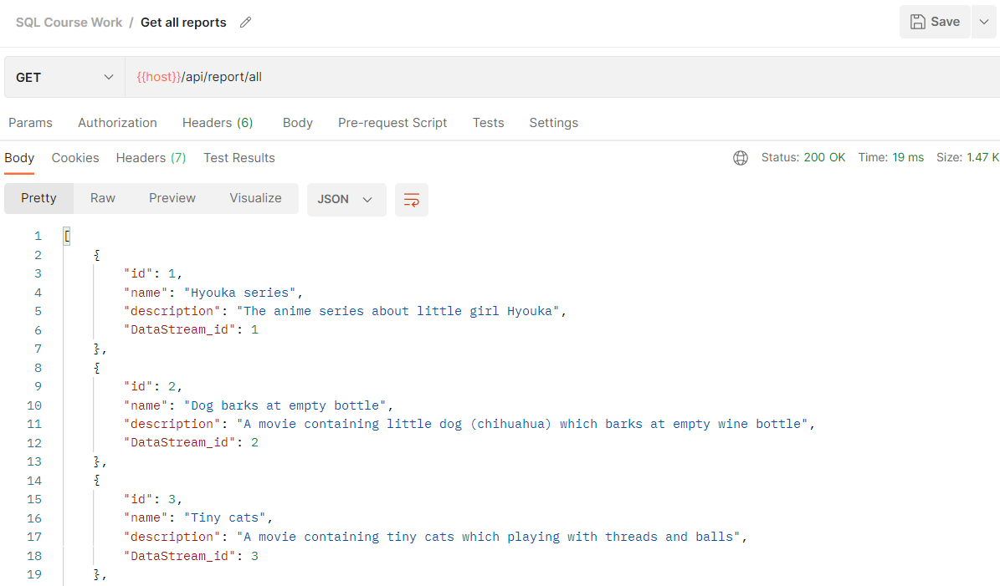
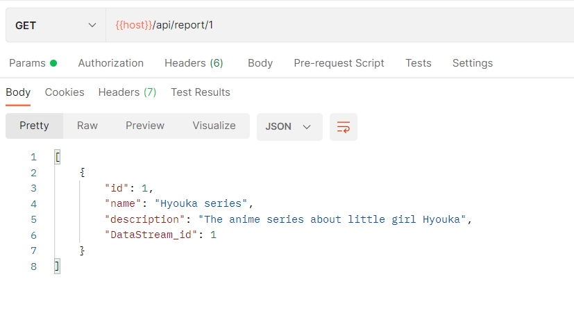
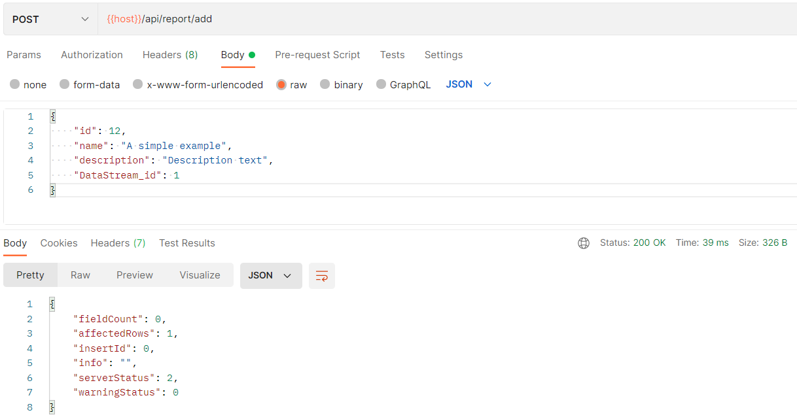
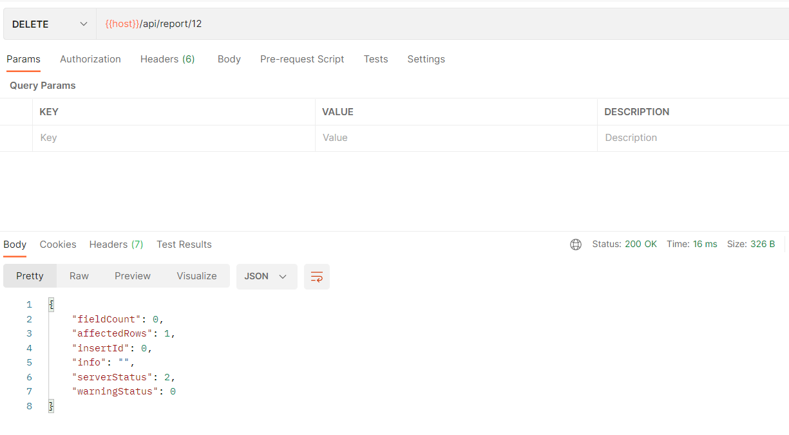
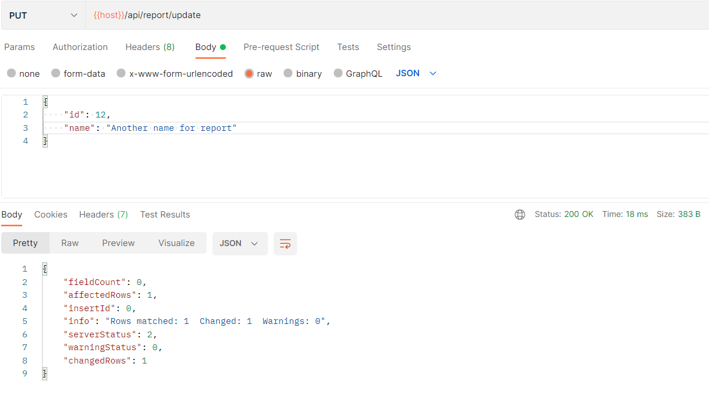

# Тестування працездатності системи

- HTTP GET, `/api/report/all` - Отримати списоок усіх звітів

- HTTP GET, `/api/report/:id` - Отримати звіт за його ID

- HTTP POST, `/api/report/add` - Додати звіт

- HTTP DELETE, `/api/report/:id` - Видалити звіт

- HTTP PUT, `/api/report/update` - Оновити звіт

